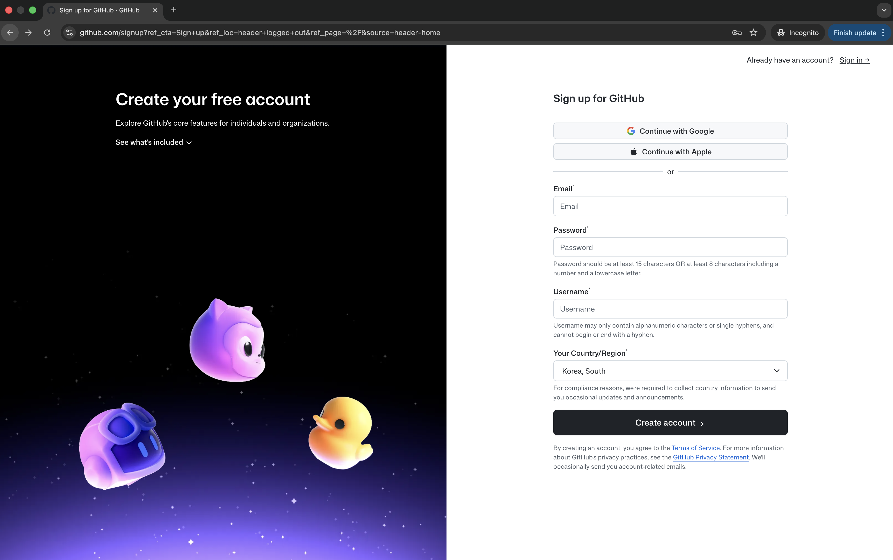

# 나만의 포트폴리오 만들기

GitHub Pages를 이용해 무료로 자기소개 웹사이트를 만드는 방법을 안내합니다.

코딩을 몰라도 괜찮습니다. 이 저장소를 포크(Fork)해서 내용만 바꾸면 됩니다.

---

## 전체 흐름

```
1. GitHub 가입  →  2. 포크(Fork)하기  →  3. GitHub Pages 켜기  →  4. 내 정보로 바꾸기  →  완성!
```

---

## Step 1. GitHub 가입하기

### 1-1. github.com에 접속해서 Sign up 클릭

[github.com](https://github.com)에 접속합니다. 오른쪽 위의 **Sign up** 버튼을 클릭합니다.


### 1-2. 가입 정보 입력

이메일, 비밀번호, 사용자 이름(username)을 차례로 입력합니다.

> **사용자 이름이 곧 내 웹사이트 주소가 됩니다!**
>
> 예: 사용자 이름이 `hong-gildong`이면
> 내 포트폴리오 주소는 `https://hong-gildong.github.io`



**username 정하기 팁**
- 본명 또는 본명의 변형을 추천합니다
- 영어 소문자와 하이픈(-)만 사용 가능
- 예: `gildong-hong`, `youngsook-s`, `minjae-kim`

### 1-3. 이메일 인증

입력한 이메일로 인증 코드가 옵니다. 코드를 입력하면 가입 완료!

---

## Step 2. 포크(Fork)로 내 저장소 만들기

포크(Fork)란 다른 사람의 저장소를 내 계정으로 통째로 복사하는 기능입니다.
원본은 그대로 두고, 내 계정에 사본이 생기므로 마음대로 수정할 수 있습니다.

### 2-1. 템플릿 저장소 접속

교수님이 안내한 템플릿 저장소 링크로 접속합니다.

### 2-2. Fork 클릭

저장소 페이지 오른쪽 위에 있는 **Fork** 버튼을 클릭합니다.

### 2-3. 저장소 이름 변경

Fork 화면에서 **Repository name**을 `username.github.io`로 바꿉니다.
`username` 부분을 **내 GitHub 사용자 이름**으로 바꿔야 합니다.

예: 사용자 이름이 `hong-gildong`이면 → `hong-gildong.github.io`

### 2-4. Create fork 클릭

초록색 **Create fork** 버튼을 클릭하면 내 계정에 저장소가 복사됩니다.

---

## Step 3. GitHub Pages 켜기

GitHub Pages는 저장소에 있는 HTML 파일을 웹사이트로 자동 변환해주는 무료 서비스입니다.

1. 포크한 저장소에서 상단의 **Settings** 탭을 클릭합니다
2. 왼쪽 메뉴에서 **Pages**를 클릭합니다 ("Code and automation" 카테고리 아래)
3. **Branch**를 **main**으로 선택하고 **Save**를 클릭합니다
4. 1~2분 후 페이지를 새로고침하면 상단에 사이트 URL이 나타납니다

```
Your site is live at https://username.github.io/
```

이 URL이 바로 내 포트폴리오 주소입니다!

> 바로 나타나지 않으면 1~2분 후 페이지를 새로고침해 보세요.

---

## Step 4. 내 정보로 바꾸기

### 4-1. index.html 편집

1. 저장소에서 `index.html` 파일을 클릭합니다
2. 오른쪽 위의 **연필 아이콘** (✏️ Edit this file)을 클릭합니다
3. **Ctrl+F** (Mac: **Cmd+F**)로 `홍길동`이나 `✏️`를 검색하면 바꿀 위치를 빠르게 찾을 수 있습니다

### 4-2. 더미 내용을 내 정보로 수정

| 바꿀 항목 | 찾을 텍스트 | 바꿀 내용 |
|----------|-----------|----------|
| 페이지 제목 | `홍길동 포트폴리오` | 내 이름 + 포트폴리오 |
| 이름 | `홍길동` | 내 이름 |
| 태그라인 | `글과 데이터 사이에서 이야기를 찾는 사람` | 나를 한 줄로 소개 |
| 전공 | `국어국문학과` | 내 전공 |
| 자기소개 | `단국대학교 국어국문학과에...` | AI로 만든 자기소개 |
| 경험 | `글쓰기 센터 튜터` 등 | 내 경험 |
| 기술 | `한국어 글쓰기`, `Python` 등 | 내 기술 |
| 이메일 | `gildong@example.com` | 내 이메일 |
| GitHub | `hong-gildong` | 내 GitHub 사용자 이름 |

> 한 번에 다 바꾸지 않아도 됩니다. 이름과 소개만 먼저 바꾸고 Commit한 뒤, 나머지는 나중에 수정해도 괜찮습니다.

### 4-3. Commit changes 클릭

수정이 끝나면 오른쪽 위의 초록색 **Commit changes...** 버튼을 클릭합니다.
Commit은 "저장" 버튼이라고 생각하면 됩니다.

### 4-4. 완성!

1~2분 후 `https://username.github.io`에 접속해서 내 정보가 반영되었는지 확인합니다.

> 변경이 반영되지 않으면 **Ctrl+Shift+R** (Mac: **Cmd+Shift+R**)로 강력 새로고침을 시도하세요.

---

## 확인 체크리스트

- [ ] PC 브라우저에서 접속 가능한가?
- [ ] 스마트폰에서도 잘 보이는가?
- [ ] 이름과 자기소개가 정확한가?
- [ ] 이메일 주소가 맞는가?
- [ ] 링크가 정상 작동하는가?

---

## 자주 묻는 질문

### Q: 수정했는데 웹사이트에 반영이 안 돼요
Commit 후 1~2분 정도 기다려 보세요. GitHub Pages는 반영에 약간의 시간이 걸립니다.

### Q: 페이지가 404 에러가 나요
- 저장소 이름이 정확히 `username.github.io`인지 확인하세요
- Settings → Pages에서 Source가 `main` 브랜치로 설정되어 있는지 확인하세요

### Q: 사진을 넣고 싶어요
1. 저장소에 `images` 폴더를 만들고 사진을 업로드합니다
2. `index.html`에서 프로필 이미지 부분의 주석을 해제하고 파일 이름을 입력합니다

### Q: 디자인을 바꾸고 싶어요
`style.css` 파일에서 색상과 폰트를 수정할 수 있습니다.
AI에게 "이 CSS에서 포인트 색상을 초록색으로 바꿔줘"라고 요청해 보세요.

### Q: 섹션을 추가하고 싶어요
AI에게 "이 HTML에 블로그 섹션을 추가해줘"라고 요청하면 코드를 만들어줍니다.

---

## 파일 구성

```
portfolio-template/
├── README.md          ← 지금 읽고 있는 안내서
├── index.html         ← 포트폴리오 메인 페이지
├── style.css          ← 디자인 파일
└── images/            ← 프로필 사진을 넣을 폴더
```
